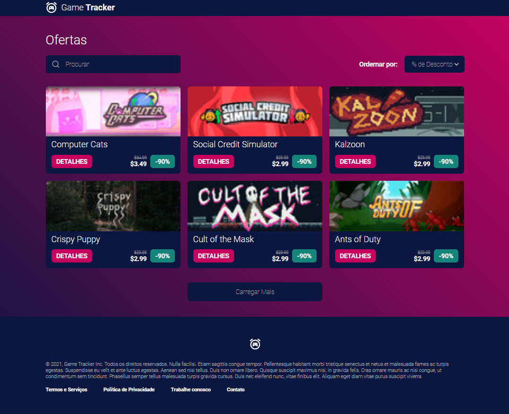

# Game tracker - Ecommerce

O projeto consiste em um catálogo de jogos seguindo o LAYOUT disponível no endereço:
 
<a href="https://www.figma.com/file/1OChnhd0T3HQdGP1TWHNbX/Game-Tracker-Prot%C3%B3tipo?node-id=0-1&t=Ogvtm7mrA87GFhry-0
">https://www.figma.com/file/1OChnhd0T3HQdGP1TWHNbX/Game-Tracker-Prot%C3%B3tipo?node-id=0-1&t=Ogvtm7mrA87GFhry-0
</a>

## Para executar o projeto
Faça o clone do projeto, na pasta "Web" instale as dependências e execute da seguinte forma
```sh
    $ npm install
    $ npm run dev
```

## Funcionalidades da Aplicação:

* Listar jogos em 4 tipos de ordens diferentes
* Pesquisar por um jogo com base em seu nome
* Lidar com dados nulos. Dados que podem ser nulos:
  * Thumb do Game
  * Valor de promoção

# Web
Aplicação desenvolvida seguindo rigorosamente o layout do figma
<p align="center">
  
</p>
<p align="center">
  
</p>

# Mobile


<p align="center">
  
</p>

# Responsividade 

A reponsividade da aplicação em tamanhos intermediários ao Layout foi pensada para se adequar de maneira melhor ao desing do projeto e pode ser vista a seguir:

<p align="center">
  
</p>
